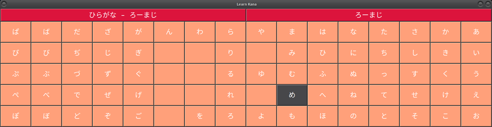

### learn-kana
a clickable Japanese kana table written in Python 3 and tkinter 

When people at work think, "Oh, I'd better find someone to write a user interface.", they rarely think of me. Recently however, I was asked to write the control, data-acq, and data-reduction code for a spectrometer. The job came with the specification that there should be an easy-to-use graphical interface. "Fine", I thought, "no one said I couldn't use Python, Matplotlib, and Tkinter." After a bit of learning, I have made something I'm kinda proud of.  

On my own time, I decided to undertake some small tkinter projects, just to get more practice. Here is one of them. It is intended for the beginning Japanese language student, like me, who want's to learn the two character types called "kana": hiragana, and katakana. I hope that it will be useful for memorization practice and for reading reference.  

